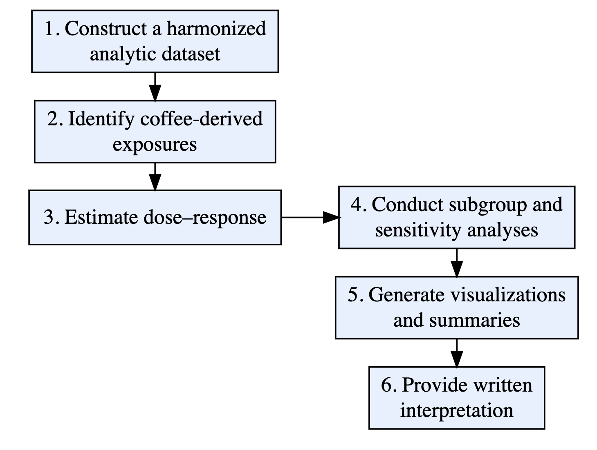

Project Proposal (github_doc)
================
2025-11-07

### The group members (names and UNIs)

Disheng Jiang (dj2763), Yurou Liu (yl6109), Ruhui Shen (rs4788), Juan
Tang (jt3649)

### The tentative project title

Exploring whether coffee is beneficial or harmful to human health by
using the National Health and Nutrition Examination Survey (NHANES)
datasets from the Centers for Disease Control and Prevention (CDC).

### The motivation for this project

Coffee, as one of the most popular beverages in the world, is highly
favored by people. Since the caffeine in coffee has a regulatory effect
on the central nervous system (Herqutanto et al., 2024), coffee is
widely consumed for alertness. The debate over whether coffee is
beneficial or harmful to human health is long standing. Some researchers
suggest that moderate coffee consumption may help reduce the risk of
type 2 diabetes and cardiovascular disease, and may be associated with
anti-inflammatory and antioxidant effects (Barrea et al., 2023).
However, other studies indicate that coffee intake could potentially
increase the risk of certain cancers and fractures(Asoudeh et al., 2023;
Carter et al., 2022). We wanted to explore the relationship between
coffee intake and health through the analysis of large amounts of data
and identify a reasonable intake level.

NHANES is uniquely well-suited for this study. NHANES contains
nationally representative sampling with detailed, standardized
measurements that are directly relevant to caffeine. It also contains
clinically measured outcomes like blood pressure, pulse and BMI,
meanwhile providing rich covariates such as age, sex, physical activity,
and socioeconomic markers. By utilizing the abundant raw data, we can
learn about the effect of coffee on human health and dose-response
patterns through data analysis and draw transparent and reproducible
public health inferences.

### The intended final products

The aim of these efforts is to generate a transparent, reproducible
empirical dataset that can be employed to address the question of
whether being a coffee drinker has beneficial, adverse, or null effects
on human health. From NHANES dietary recall data, individual food item
files, measures from the covariate, and physiologic examination files we
will create a harmonized dataset that includes coding for coffee
beverage, while separating coffee’s caffeine intake through the food
codes or nutrient intakes. We will estimate dose–response relationships
with standard drinks of caffeine in relation to SBP and DBP, resting
pulse rate, BMI and sleep duration or daytime sleepiness (both
self-report), depressive symptoms. We also will conduct additional
subgroup and sensitivity analyses (e.g., analysis of different levels of
caffeine consumption, stratification by age, sex and physical activity,
use of FDA guidance thresholds closer to 400 mg/day) to assess the
extent to which any associations observed vary across subpopulations.
The final products will be a well-documented analytic data set,
reproducible code for all data manipulation and analysis steps,
graphical representations and summary tables that demonstrate patterns
of consumption and relationships with outcomes, and a brief written
interpretation stating whether caffeine intake seems to have beneficial,
neutral or adverse effects on health considering uncertainties,
limitations.

### The anticipated data sources

The project will use publicly available data from the 2021-2023 NHANES
maintained by CDC.

We will combine multiple datasets that recall participants’ demographic
information, physical and laboratory examination results, and their
dietary intake of coffee.

- The demographic file (DEMO_L.xpt) provides key covariates such as age,
  sex, and socioeconomic indicators. Health outcome data will be drawn
  from physical examination and laboratory files.

- Physical examination datasets including BMX_L.xpt (Body Measures) and
  BPXO_L.xpt (Blood Pressure) will supply directly measured
  anthropometric and cardiovascular indicators such as BMI, and
  systolic/diastolic blood pressure.

- Lab data measure metabolic, cardiovascular, and inflammatory
  biomarkers, including fasting glucose, insulin, glycohemoglobin,
  cholesterol and triglycerides, high-sensitivity C-reactive protein,
  and kidney and liver function markers.

- There is also self-reported sleep disorder (SLQ_L.xpt) dataset which
  we will use to analyze the effect of coffee intake.

### The planned analysis / visualizations

1.  Exploratory Analysis of Coffee-Derived Caffeine Intake Patterns

- Use grouped violin plots or stacked percentage bar charts to display
  the distribution of coffee-derived caffeine intake by age, sex, and
  weekday vs. weekend.
- Conduct statistical tests to quantify between-group differences.
- Calculate simple correlation coefficients between coffee-derived
  caffeine intake and key health outcomes. (e.g., blood pressure, sleep
  duration, and other biomarkers).

2.  Visualizations of Dose-Response Relationships

- Use scatter plots with smoothed curves to visually present the
  relationship between continuous coffee-derived caffeine intake and
  each health outcome.

3.  Subgroup Analysis

- Stratify the study sample into subgroups based on key variables such
  as age group and sex. Fit dose-response relationships between
  coffee-derived caffeine intake and health outcomes within each
  subgroup and visualize them for intuitive comparison.

4.  Sensitivity Analysis

- Conduct sensitivity analyses using thresholds (e.g., FDA guidance:
  ~400 mg/day) by treating caffeine intake as a categorical variable or
  fitting piece-wise regression models, to assess the robustness of the
  findings from the primary association analysis.

### Coding challenges

The main challenges involve correctly handling NHANES complex survey
design, precisely isolating caffeine sources from hundreds of food
codes, creating clear visualizations for subgroup and dose-response
curves, and conducting statistical tests using survey-weighted methods.
These steps are important for ensuring the accuracy and reliability of
the analytical results.

### The planned timeline

| date | work |
|:--:|:---|
| 11/7 | Determine project topic, find data source, complete the proposal |
| 11/8–11/12 | Zoom meeting: determine final datasets and how to analyze data |
| 11/12–11/16 | Complete final source collection |
| 11/15–11/16 | Zoom meeting: determine detailed division of work |
| 11/16–11/19 | Clean and tidy data |
| 11/19–11/20 | Zoom meeting: design website structure |
| 11/21–11/26 | Plot graphs and analyze data |
| 11/26–12/1 | Complete report with visualizations and interpretations |
| 12/2–12/3 | Proofread report |
| 12/3–12/6 | Final webpage improvement and screencast |

Project Timeline
