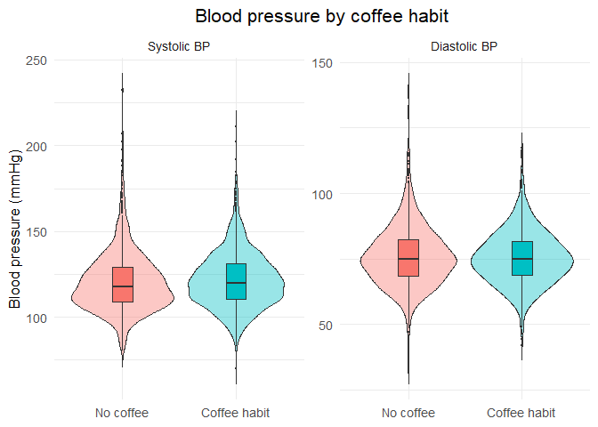
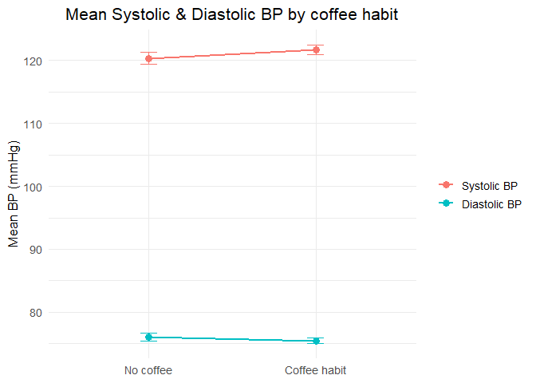
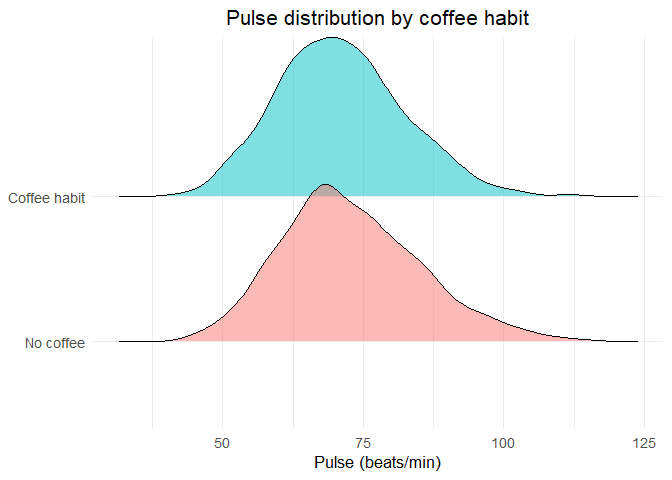
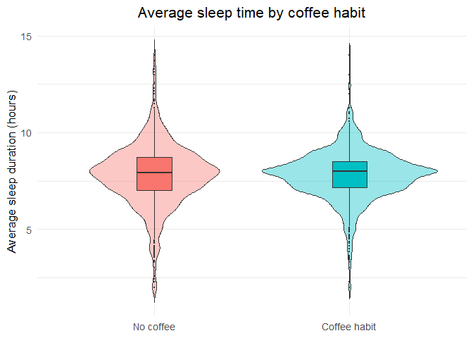
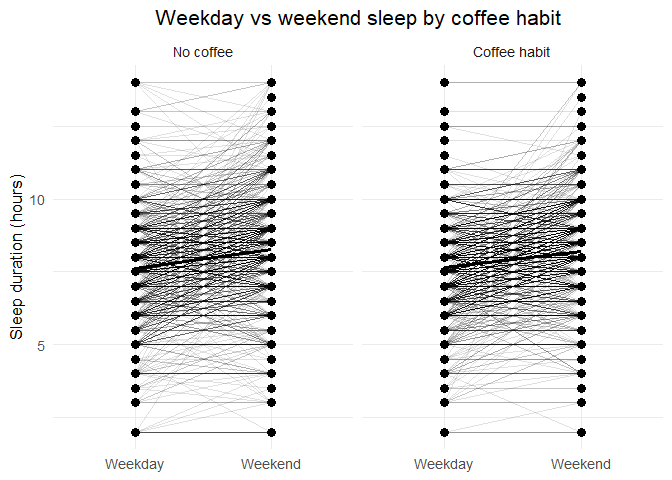

Pulse & Pressure
================

## 1. Blood Pressure Violin + Boxplots

``` r
bp_long <- bp_sleep_df |>
  select(seqn, coffee_group, sbp, dbp) |>
  pivot_longer(cols = c(sbp, dbp),
               names_to = "bp_type",
               values_to = "bp_value") |>
  mutate(
    bp_type = factor(
      bp_type,
      levels = c("sbp", "dbp"),
      labels = c("Systolic BP", "Diastolic BP")
    )
  )

gg_bp_violin <- ggplot(bp_long,
                       aes(x = coffee_group,
                           y = bp_value,
                           fill = coffee_group)) +
  geom_violin(alpha = 0.4, trim = FALSE) +
  geom_boxplot(width = 0.18, outlier.size = 0.5) +
  facet_wrap(~ bp_type, scales = "free_y") +
  labs(x = NULL, y = "Blood pressure (mmHg)",
       title = "Blood pressure by coffee habit") +
  theme_minimal(base_size = 13) +
  theme(legend.position = "none", 
        plot.title = element_text(hjust = 0.5))
gg_bp_violin
```

    ## Warning: Removed 114 rows containing non-finite outside the scale range
    ## (`stat_ydensity()`).

    ## Warning: Removed 114 rows containing non-finite outside the scale range
    ## (`stat_boxplot()`).

<!-- --> The
distributions of systolic and diastolic blood pressure among groups that
consumed coffee are shown in this figure. Violin shapes show the whole
density and range of values, and integrated boxplots make it easy to
compare medians and interquartile ranges. There are just little changes
between the groups; for example, those who regularly drink coffee had
somewhat higher systolic readings. It seems that missingness is not
systematic, as the NA group exhibits behavior that is consistent with
the other categories. Potential, however modest, correlations between
blood pressure and regular coffee use are efficiently brought to light
by this depiction.

## 2. Mean BP with 95% CI Line Plot

``` r
bp_summary <- bp_sleep_df |>
  group_by(coffee_group) |>
  summarise(
    mean_sbp = mean(sbp, na.rm = TRUE),
    se_sbp   = sd(sbp, na.rm = TRUE) / sqrt(sum(!is.na(sbp))),
    mean_dbp = mean(dbp, na.rm = TRUE),
    se_dbp   = sd(dbp, na.rm = TRUE) / sqrt(sum(!is.na(dbp)))
  ) |>
  pivot_longer(
    cols = -coffee_group,
    names_to = c("metric", "bp_type"),
    names_sep = "_"
  ) |>
  pivot_wider(
    names_from = metric,
    values_from = value
  ) |>
  mutate(
    bp_type = factor(
      bp_type,
      levels = c("sbp", "dbp"),
      labels = c("Systolic BP", "Diastolic BP")
    )
  )

gg_bp_mean_line <- 
  ggplot(bp_summary, aes(x = coffee_group, y = mean, color = bp_type, group = bp_type)) +
  geom_point(size = 3) +
  geom_line(linewidth = 1) +
  geom_errorbar(aes(ymin = mean - 1.96 * se, ymax = mean + 1.96 * se), width = 0.1) +
  labs(x = NULL, y = "Mean BP (mmHg)",
       color = NULL,
       title = "Mean Systolic & Diastolic BP by coffee habit") +
  theme_minimal(base_size = 13) + 
  theme(plot.title = element_text(hjust = 0.5))
gg_bp_mean_line
```

<!-- -->
Displayed here with 95% confidence intervals are the mean diastolic and
systolic blood pressure readings for the whole cohort. The group that
regularly drinks coffee had somewhat higher systolic blood pressure than
the group that does not, but there is no change in diastolic blood
pressure. Since the confidence intervals for different groups overlap,
it’s possible that the observed changes in means may not reflect
significant impacts. In addition to the distributions given for
individuals, this graphic gives a clear picture of the population as a
whole.

## 3. Pulse Ridgeline Plot

``` r
gg_pulse_ridge <- 
  ggplot(bp_sleep_df, aes(x = pulse, y = coffee_group, fill = coffee_group)) +
  geom_density_ridges(alpha = 0.5, scale = 1.1) +
  labs(x = "Pulse (beats/min)", y = NULL,
       title = "Pulse distribution by coffee habit") +
  theme_minimal(base_size = 13) +
  theme(legend.position = "none", 
        plot.title = element_text(hjust = 0.5))
gg_pulse_ridge
```

    ## Picking joint bandwidth of 2.48

    ## Warning: Removed 57 rows containing non-finite outside the scale range
    ## (`stat_density_ridges()`).

<!-- --> The
ridgeline density plot visualizes pulse-rate distributions across coffee
habits. While the overall shapes are similar, the coffee-habit group
appears to trend slightly higher in pulse rate, though the overlap
between groups is substantial. This plot effectively demonstrates
distributional differences without relying on summary statistics and
provides an intuitive sense of how pulse varies across the cohort.

## 4.Average Sleep Duration Violin Plot

``` r
gg_sleep_violin <- 
  ggplot(bp_sleep_df, aes(x = coffee_group, y = sleep_avg, fill = coffee_group)) +
  geom_violin(alpha = 0.4, trim = FALSE) +
  geom_boxplot(width = 0.18, outlier.size = 0.5) +
  labs(x = NULL, y = "Average sleep duration (hours)",
       title = "Average sleep time by coffee habit") +
  theme_minimal(base_size = 13) +
  theme(legend.position = "none", 
        plot.title = element_text(hjust = 0.5))
gg_sleep_violin
```

    ## Warning: Removed 32 rows containing non-finite outside the scale range
    ## (`stat_ydensity()`).

    ## Warning: Removed 32 rows containing non-finite outside the scale range
    ## (`stat_boxplot()`).

<!-- -->
This visualization shows the distribution of average daily sleep time
across coffee-consumption categories. The central tendencies differ only
slightly, with coffee-habit individuals sleeping marginally less on
average. The overall shape and spread are similar across categories,
suggesting that habitual coffee intake is not strongly related to
average sleep duration. The combination of violin and boxplot elements
provides both distributional context and robust summary measures.

## 5. Weekday vs Weekend Paired Sleep Plot

``` r
sleep_long <- bp_sleep_df |>
  select(seqn, coffee_group, sleep_weekday, sleep_weekend) |>
  pivot_longer(
    cols = c(sleep_weekday, sleep_weekend),
    names_to = "day_type",
    values_to = "sleep_hours"
  ) |>
  mutate(
    day_type = factor(
      day_type,
      levels = c("sleep_weekday", "sleep_weekend"),
      labels = c("Weekday", "Weekend")
    )
  )

gg_sleep_paired <- 
  ggplot(sleep_long, aes(x = day_type, y = sleep_hours, group = seqn)) +
  geom_line(alpha = 0.12) + 
  stat_summary(fun = mean, geom = "line", aes(group = 1), linewidth = 1.2, color = "black") +
  stat_summary(fun = mean, geom = "point", size = 3, color = "black") +
  facet_wrap(~ coffee_group) +
  labs(x = NULL, y = "Sleep duration (hours)",
       title = "Weekday vs weekend sleep by coffee habit") +
  theme_minimal(base_size = 13) + 
  theme(plot.title = element_text(hjust = 0.5))
gg_sleep_paired
```

    ## Warning: Removed 45 rows containing non-finite outside the scale range
    ## (`stat_summary()`).
    ## Removed 45 rows containing non-finite outside the scale range
    ## (`stat_summary()`).

    ## Warning: Removed 45 rows containing missing values or values outside the scale range
    ## (`geom_line()`).

<!-- -->
Individual differences in sleep duration on weekdays and weekends are
shown by this paired-line plot. People in every coffee group get more
shut-eye on weekends, and the size of the difference between weekday and
weekend sleep is about the same. Individual variability is shown by the
dense cluster of light gray lines, while the group-average pattern is
captured by the overlay black summary line. This graph shows that the
difference in sleep between the weekdays and weekends is unaffected by
coffee use.
